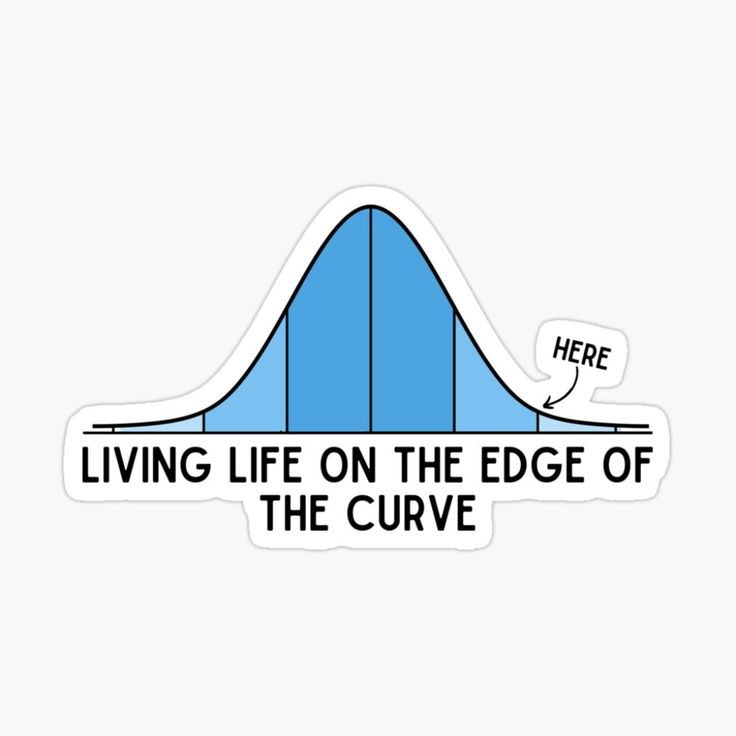

<h1 align="center">Hi 👋, I'm Thota Thanusri</h1>

<p align="center">
  
</p>

<p align="center">
🎓 CSE (Data Science) Student • 🤖 AI Enthusiast • 📊 Aspiring Machine Learning Engineer • ✍️ Technical Writer
</p>

---

# 🌸 About Me

```python
class Thanusri:

    def __init__(self):
        self.role = "Computer Science Student (Data Science)"
        self.learning = [
            "Machine Learning",
            "Statistics",
            "AI Agents",
            "System Design",
            "Backend Development"
        ]
        self.interests = [
            "Artificial Intelligence",
            "Data Analytics",
            "Open Source",
            "Storytelling with Data"
        ]
        self.motto = "Learn by Building."
```

---

# 🚀 Current Journey

🌱 Learning Machine Learning from scratch (without relying on libraries first)

💡 Building practical AI projects

📊 Exploring Statistics and Data Analysis

🤖 Experimenting with AI Agents and LLM Applications

✍️ Writing about everything I learn

---

# 🛠 Tech Stack

### Languages

<p>


</p>

### Frameworks & Backend

<p>


</p>

### Databases

<p>


</p>

### Data Science

- Pandas
- NumPy
- Matplotlib
- Scikit-Learn
- Power BI

### Tools

<p>


</p>

---

# 🌟 Featured Projects

## 💰 AI Expense Tracker

An AI-powered expense tracker that understands natural language and automatically categorizes expenses using LLMs.

**Tech Used**

- FastAPI
- Supabase
- Gemini API
- Python

---

## 📈 Machine Learning From Scratch

Implementing Machine Learning algorithms from scratch to understand the mathematics behind them.

Current Progress:

- ✅ Linear Regression

Coming Soon:

- Logistic Regression
- Decision Trees
- KNN
- K-Means
- Neural Networks

---

## 📊 Hospitality Analytics Dashboard

Power BI dashboard for hotel performance analysis and business insights.

---

## 👩‍💻 SheRise

Interactive website focused on women empowerment.

---

## 📚 Narrative Consistency Checker

Hackathon project that checks long-context narrative consistency using AI.

---

# 📈 GitHub Stats

<p align="center">


</p>

---

# 🔥 GitHub Streak

<p align="center">


</p>

---

# 📊 Contribution Graph

<p align="center">


</p>

---

# 📖 Currently Learning

- Machine Learning Mathematics
- Statistics for Data Science
- AI Agent Architecture
- FastAPI
- MLOps Fundamentals

---

# 🎯 2026 Goals

- 🚀 Build 10+ AI Projects
- 🤖 Learn Machine Learning in depth
- 📚 Contribute to Open Source
- 🏆 Participate in National Hackathons
- ✍️ Publish technical blogs regularly
- 🌟 Land a Machine Learning Internship

---

# 💭 Favorite Quote

> *"The best way to learn is to build something that scares you a little."*

---

# 😂 Data Scientist Mood

<p align="center">
  
  &nbsp;&nbsp;&nbsp;&nbsp;
  
</p>

<p align="center">
<i>Powered by Pandas • Living life on the edge of the curve 📈</i>
</p>

---

# 🌱 Fun Facts

☕ Debugging teaches patience.

📊 Every dataset tells a story.

🤖 I enjoy understanding *how* algorithms work instead of just using them.

✍️ I like documenting my learning journey through writing.

---

# 🤝 Let's Connect

<p>

<a href="https://github.com/thanusrithota2007-ui">

</a>

<!-- Replace with your LinkedIn profile -->

<a href="https://www.linkedin.com/in/thota-thanusri/">

</a>

</p>

---

<p align="center">

### ⭐ Thanks for stopping by!

*"Every commit is another step toward becoming the engineer I want to be."*

</p>
